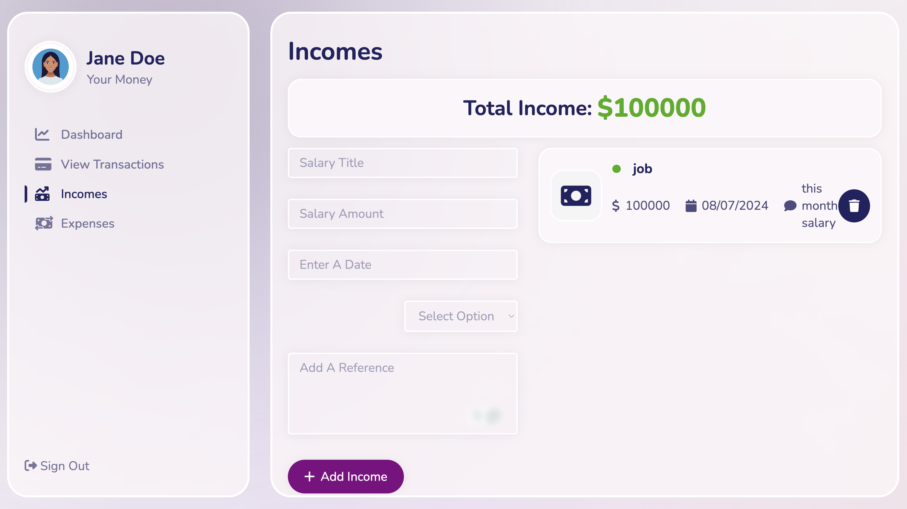
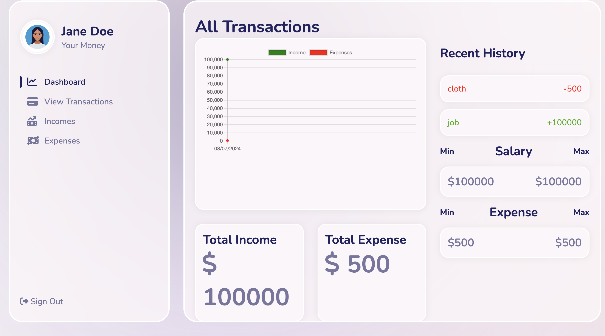

Pennywise - React Expense Tracker
Pennywise is a simple and efficient React-based expense tracker application that helps you manage your income and expenses. Track your finances effortlessly and generate detailed reports to better understand your financial habits.
# Pennywise Expense Tracker


Track your expenses and manage your finances with Pennywise, a simple and efficient expense tracker built using the MERN stack.

- Deployed Site: [Link to Deployed Site](https://www.yourdeployedsite.com)
- Final Project Blog Article: [Link to Blog Post](https://www.medium.com/@yourblogarticle)
- Author(s) LinkedIn: [Author Name](https://www.linkedin.com/in/authorname)

## Table of Contents
- [Installation](#installation)
- [Usage](#usage)
- [Contributing](#contributing)
- [Screenshots](#screenshots)

## Installation

To run Pennywise locally, follow these steps:

1. Clone the repository
2. Install dependencies
   npm install

3. Set up environment variables:
- Create a `.env` file in the root directory.
- Add the following variables:
  ```
  REACT_APP_API_URL=http://localhost:5000/api  
  ```
  
4. Start the application:
   npm start

## Usage

- Register an account or log in if already registered.
- Add your income and expenses.
- View detailed reports and summaries of your financial transactions.

## Contributing

We welcome contributions to Pennywise! To contribute:
- Fork the repository.
- Create your feature branch: `git checkout -b feature/AmazingFeature`.
- Commit your changes: `git commit -m 'Add some AmazingFeature'`.
- Push to the branch: `git push origin feature/AmazingFeature`.
- Open a pull request.

## Screenshots





